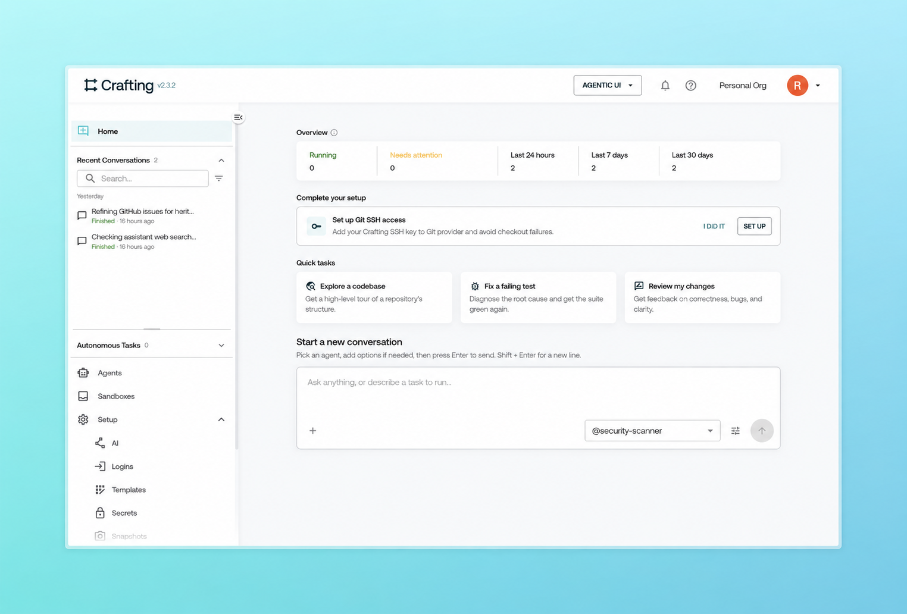

# Crafting Express Edition

**Run and coordinate AI agents in a single Docker container.**

Crafting Express lets you evaluate Crafting’s agent execution and orchestration
platform on your own machine. Launch agents, coordinate handoffs, and inspect their
work through a web UI and CLI.

> Express is for evaluation only. Production deployments use Crafting Enterprise.

## Quick Start

Download the Crafting CLI:

```sh
curl -sSL https://sandboxes.cloud/sh/install-cli | bash
```

Alternatively, you can download it [directly here](docs/Download.md).

Launch _Crafting Express Edition_ using a single command:

```sh
cs express start
```

It will guide you to:
- Sign-up and log in
- Create Docker volumes for persisted states and data
- Create a Docker container to run _Crafting Express Edition_
- Create a demo Kubernetes cluster running the Boutique shop, connected to
  Express for the Kubernetes interception tutorial (skip it with
  `--disable-demo`)
- Instructions on how to access _Crafting Express Edition_ via Web UI and CLI

For more details, check out our [documentation](https://docs.sandboxes.cloud).

## System requirements

- **Docker** 20 or later: Docker Desktop on macOS, or Docker Engine on Linux.
- **Memory**: 8 GB allocated to Docker for Express, the demo cluster, and a
  sandbox running the tutorial. In Docker Desktop, set this under
  **Settings → Resources**.
- **Disk**: at least 8 GB free for Docker volumes; 40 GB is recommended.
- **Network**: internet access. The first start downloads the Express and
  Boutique images and connects to `exp.sandboxes.cloud`.

## Built for teams of agents

Crafting brings agent coordination and execution environments together in one
platform. Express gives you a local evaluation of that platform; production
infrastructure integrations and enterprise controls are available through Crafting
Enterprise.

- **Delegate work to specialist agents.** A lead agent can split a task among
  coding, testing, and security agents. Sub-agents run in parallel with separate
  conversation contexts, return results to the lead, and receive follow-up work
  as needed. [Build an agent team](https://docs.sandboxes.cloud/guides/developers/build-agent.html#agent-team).

- **Choose models without replacing your harness.** Crafting's native harness
  supports OpenRouter, compatible self-hosted endpoints, AWS Bedrock, and Google
  Cloud Vertex AI. Centrally managed model configuration lets you evaluate new
  models while keeping your agent definitions and execution environments.
  [Model-agnostic agent teams](https://www.crafting.dev/post/model-agnostic-agent-teams).

- **Share workspaces when collaboration calls for it.** Give agents dedicated
  environments or let multiple agents work in an existing workspace. Engineers
  can work alongside agents using the same codebase and development tools.
  [See how Faire collaborates with agents](https://www.crafting.dev/post/faire-agentic-stack-case-study).

- **Scope tools and access to each agent's role.** Define the tools, dependencies,
  and access each agent needs. The Crafting platform combines sandbox access
  controls, network isolation, and managed credentials to constrain what agents
  can reach as they coordinate across systems.
  [How infrastructure-level control works](https://www.crafting.dev/blog/ai-control-plane-infrastructure-vs-governance).

- **Give agents an environment to test their work.** Connect agents to real
  services and dependencies in production-like environments so they can run
  tests, inspect failures, and iterate on a fix. Agents and engineers can validate
  changes in parallel using isolated slices of your application stack.
  [Closing the loop with Crafting](https://www.crafting.dev/post/announcing-crafting-for-agents).

## Hitting the limits of Express?

Upgrade to the Enterprise edition to manage and run agents at scale.

- **Connect to your k8s cluster** — agents execute against your real infrastructure,
  not a container
- **Multi-cloud and multi-region** by default — automated failover, no vendor lock-in
- **Secure access to internal systems** — credential injection scoped per agent,
  admin-managed, never exposed
- **SOC 2 Type II certified** — independently audited for security and availability

We'll get you up and running in two weeks or less.

[Talk to us about Enterprise →](https://crafting.dev/contact)

> **DISCLAIMER** — Crafting Express Edition runs inside a single Docker container
> for **trial and evaluation purposes only** and is provided as-is without warranty.
> It is not the Enterprise Edition. For production use, contact Crafting.
